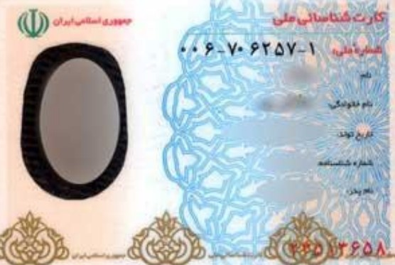
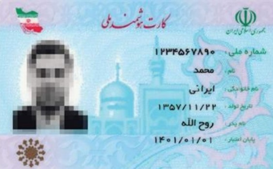
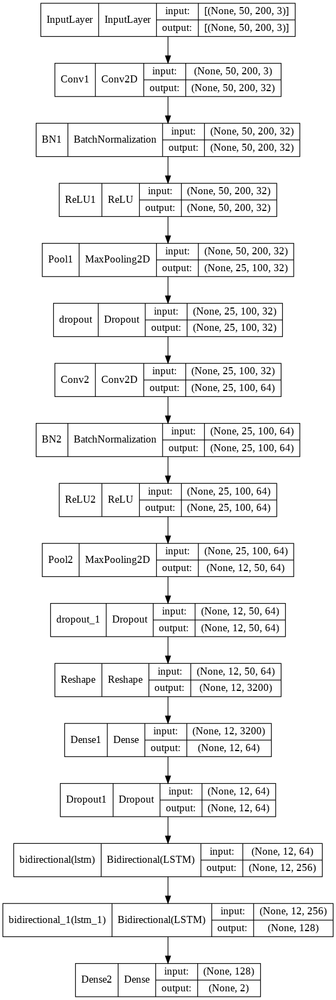
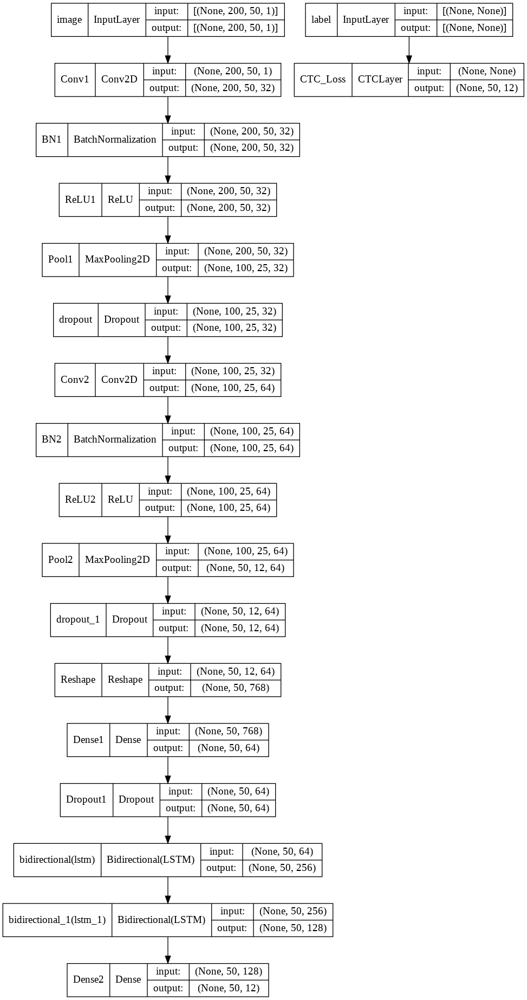
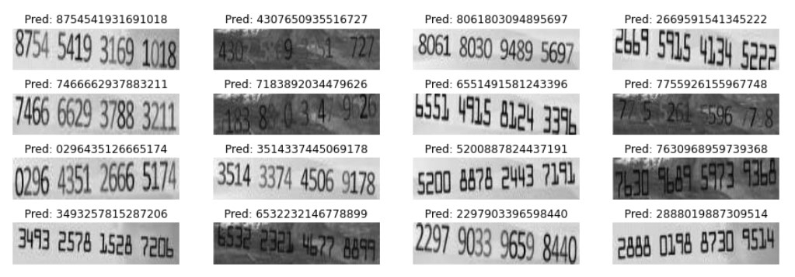
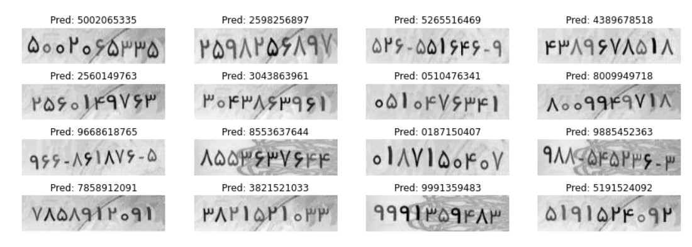

# CardNumber-DeepOCR

Iranian Credit card and National card Deep Optical Character Recognition (OCR) using Keras.

Dataset is synthesized using OpenCV.


## Dataset

### Iranian Credit Card (Different Banks)
Mellat Bank            |  Melli Bank
:-------------------------:|:-------------------------:
  |  

Synthesized credit cards images path: Datasets/train_train_synthesized.zip inside Credit folder

### Iranian National card
Old ones            |  New ones
:-------------------------:|:-------------------------:
  |  

Synthesized national cards images path: Datasets/train_train_synthesized.zip inside National folder


## Model

1. Synthesizing data and pre-processing [[Notebook]](Notebooks/Dataset.ipynb)
2. Classify the image (Credit or National) [[Notebook]](Notebooks/National_Credit_Classifier.ipynb)
3. Feed images to OCR network [[Notebook]](Notebooks/OCR_Network.ipynb)
4. Wrapping the pipeline [[Notebook]](Notebooks/E2E_Wrapper.ipynb)

### Classifier


### OCR



## How to run

For testing open ```E2E_Wrapper.ipynb``` inside Google Colab or open ```e2e_wrapper.py```

### API's:
Predict on a single image
```bash
predict_single_path(path, label=None)
```

Predict on a single image and show image, ground truth
```bash
single_file_show(path, label)
```

Predict on all images inside a folder path and report some metrics:
```bash
predict_folder(folder_path)
```


## Results

Credit cards            |  National cards
:-------------------------:|:-------------------------:
  |  


## App Demo


